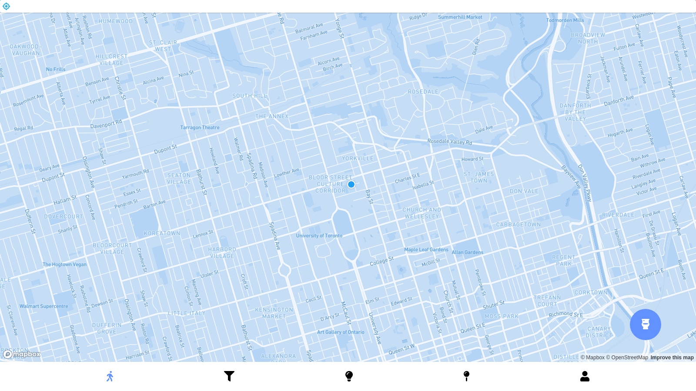
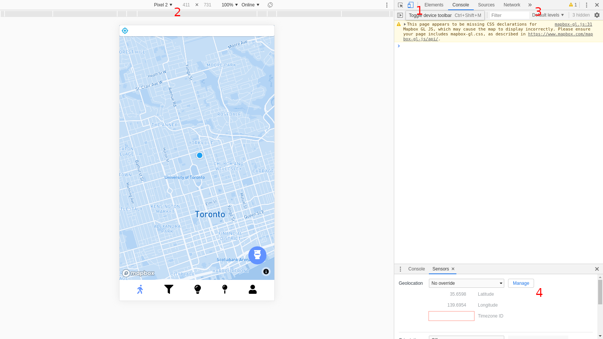
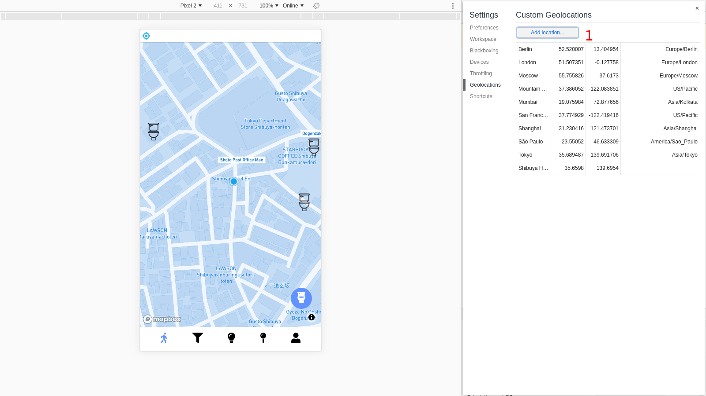

# Tokyo Toilets

> Disclaimer: This was a self-driven school project (team of two including me) that was initially coded in a private repository. I ported the project over after the class finished, that is why there is no commit history. 

## Description 
Tokyo Toilets is a toilet accessibility and education tool. It helps users find the closest public toilet available to them that suits their use case. Additionally, the application has toilet tutorials. The problem we are trying to solve is that there exists many tourists in Tokyo that struggle with using or finding toilets that suit their needs.

Some additional context is that there exists many convenience stores in Tokyo which have bathrooms available for public use, but are random in terms of the types of toilets and amenities they offer. It can be troubling to be in an unfamiliar place, trying to use a toilet that you don't understand how to use, or trying to change your child's diaper, only to find no changing stations in the bathrooms you are checking.

Our application solves this by pairing users to the toilets near to them that will allow them to get in and use the amenities as quickly as possible, while ensuring that the amenities that they need are available, as well as helping them understand how to use them once they arrive with our diagrams, tutorials, and translations.

## Key Features
 ### Feature 1: Finding the closest toilet 

When the user opens the application, they can immediately find the closet toilet to them by clicking the navigation floating button in the bottom right.
This feature gets the users location via geolocation, and calculates the closest toilet with the lowest average waiting time to their current coordinates.
The user can see directions to that toilet, which are pulled from the Mapbox API. 
From D1, this feature covers user story #1.

 ### Feature 2: Toilet Tutorial 

On the bottom menu bar, there is a toilet tutorial guide. 
This guide includes two different tutorial info-graphics. One for squatting toilets and one for electric toilets. 
From D1, this feature covers user story #2 and user story #5.

 ### Feature 3: Filtering Toilets

On the bottom menu bar, there is a filter function to filter toilets by their various types. 
Initially, all toilets will be shown on the map. However, when a user selects a filter, only toilets guaranteed to have those selected attributes are displayed, ensuring that users will arrive and find the services they need. 
From D1, this feature covers user story #3 and user story #4.


## Instructions
The application is hosted on Heroku and is available here: https://infinite-temple-28799.herokuapp.com/. Please allow up to 30 seconds for the app to start up for the first time. No account creation is required, as we did not choose to implement user accounts in the MVP.

### Mobile device simulation

Because this web application was developed for mobile device users in Tokyo, there are a few things you'll have to do in order to use it as it was intended. We will cover steps to simulate the mobile viewport and geolocation spoofing using Google Chrome, however, if you're familiar with doing this on the browser of your choice, you are free to try. 

*You don't need to spoof your location for this MVP to work, as we have also hard coded the hotel coordinates for the user as a fallback, however, you won't see the blue dot indicating location on the map, and won't be able to change the location yourself. If you choose not to spoof, please DO NOT allow location access.*

If you just opened the link above, you would be prompted to allow location access, and would be met with the following view of the toilet map (the main "Explore" feature):



However you are most likely not testing on a mobile device, and you would not be in Tokyo, where the toilets are plotted! I am in Toronto, and there is nothing around me. To solve this:



1. Click the button to transform the browser window to match a mobile device profile.
2. You can select any phone, for example, the Pixel 2. Please keep it in portrait mode however.
3. Open up the Sensors panel, sometimes it is not already visible, and you'll have to use these arrows to find it.
4. In the Sensors panel, click the Manage button to open up a view to add new locations.



1. Click the add location button and add the following location like the bottom record in the above image, that we've used for our testing:

```
Name: Shibuya Hotel En
Latitude: 35.6598
Longitude: 139.6954
```

Finally, close the popup for adding locations, and select the new "Shibuya Hotel En" location in the Sensors tab, and refresh the page:


### Feature overview and instructions

In general, the different features are accessed by a global navigation bar of icons that is always present at the bottom of the screen. Click an icon to move to that feature. The currently active feature will be highlighted with the application accent colour. Instructions will be provided for features from left to right:


1. Explore
   - This is the main feature of the application. You can scroll and zoom the map. The target button at the top left will recenter the view of the map on your location if you deviate.
   - Tap on toilets on the map to see details about them, tap the popup once open to hide it again.
   - Tap the toilet icon floating action button at the bottom right to start a trip to the fastest toilet (meaning the toilet with the lowest travel + wait time). You will see a path plotted on the map, and a header with trip metadata appear.
   - In the trip view, press the bottom most "curved arrow" floating action button to get turn by turn directions.
   - In the trip view, press the "flag" floating action button to end your trip, and return to the default map view.
2. Filter
   - These check boxes allow uses to filter and display only toilets which have all of the selected tags on the map in the Explore tab.
   - With no boxes checked, no filters are applied. The filtering is like an AND clause on records. It is possible for a selection to result in no toilets plotted on the map.
3. Learn
   - This feature serves to help users understand toilet culture in Japan, and to make electric toilets more accessible with detailed diagrams and translations.
   - Currently just a work in progress, under the Guides section, click one of the guides to bring up a modal of a horizontally scroll-able image.
4. Contribute
   - This feature was not implemented as part of the MVP, a more detailed message is displayed in the app for users.
5. Account
   - This feature was not implemented as part of the MVP, a more detailed message is displayed in the app for users.

 ## Development requirements

Develop on any Unix based system (Mac OS, or Linux)
Install Node JS version 10 or above, and Yarn version 1.22 or above

Step 1: `$ git clone https://github.com/csc301-summer-2020/team-project-5-tokyo-toilets.git`

Step 2: `$ cd team-project-5-tokyo-toilets`

Step 3: `$ yarn install`

Step 4: `$ yarn dev`

An instance of the web application may automatically open in your default browser.

 ## Deployment and Github Workflow
We have two main branches, `development` and `master`. When one of us wants to add a feature, we create a branch off our `development` branch. Then, once we are ready we open a pull-request from our feature branch into the `development` branch. When one of us opens a PR, the other reviews it, and may leave comments. Typically to save time, the reviewer will also just merge it upon approval. Typically we just name our branches in "kebab-case", and keep it descriptive e.g. "add-toilet-markers".

We deploy using Heroku, and have automatic deployment set up from `master`.  When we are ready to deploy, we merge our `development` branch into `master` and Heroku detects the changes and will automatically trigger a rebuild and redeployment. Then, we both stand-by in case there are any build errors.

We chose this workflow because it makes the most sense for a team of two, and it is what we are most familiar with. Reviewing and merging each other's PR's ensure we are up to date on what is going on and no one is left out of the loop. Keeping master buffered from development introduces more control in when we want to release, and keeps the deployed instance more stable.

 ## Licenses

We applied the MIT license to our codebase. This gives little to no restrictions on our development, and it gives the public full use of our codebase for free. The reason we chose to be "open source" is because our codebase can be used as a template for other crowd sourcing applications. For example, if someone wanted to build an application crowd sourcing public water fountains, it would be easy to clone our repository and follow a similar structure. Picking and placing objects on a map, directions, and user profiles are all generic features that can be useful to the public. 

